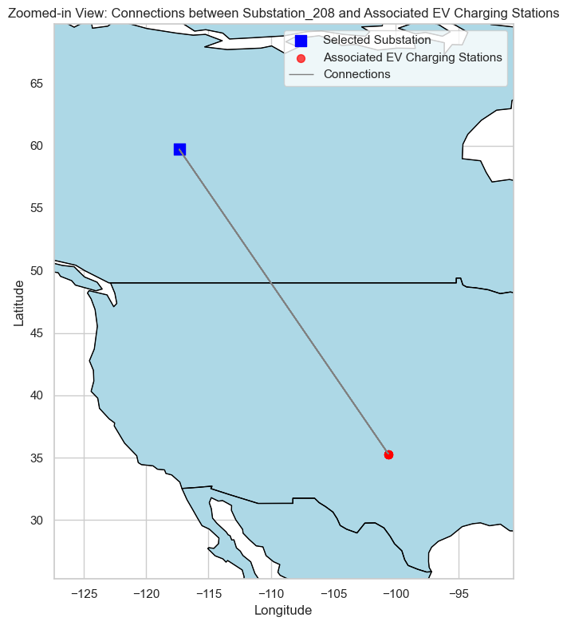

# Distribution Network Analysis for PowerCharge Utilities

# Project Overview

As the energy sector embraces sustainability, the rising adoption of electric vehicles (EVs) is putting new pressure on utility distribution networks. This project, conducted for PowerCharge Utilities, analyzes the capacity of the electrical grid to handle increased EV charging demand and recommends data-driven strategies for future optimization.

# Business Problems
- **Increased Load Demand:** EVs are elevating peak-time loads.

- **Grid Overloads:** Leading to voltage drops and outages.

- **Customer Satisfaction:** Charging reliability is essential.

- **Cost Management:** Balancing reliability with infrastructure cost.

# Project Objectives
- Assess network capacity under current and future EV load.

- Identify potential bottlenecks in the grid infrastructure.

- Optimize network upgrade strategy using geospatial analytics.

- Evaluate weather and EV behavior impacts on energy consumption.

## Dataset Description

| Dataset Name              | Description                                                                                   |
|--------------------------|-----------------------------------------------------------------------------------------------|
| `ev_distribution_dataset.csv` | Contains timestamped data on electricity consumption, EV types, charging habits, and associated substations. |
| `geospatial_dataset.csv`      | Provides substation IDs, geographic coordinates, and transmission line capacities (in MW).  |
| `weather_dataset.csv`         | Includes weather conditions such as temperature, precipitation, and weather types by timestamp and substation. |


# Tools Used
The project was developed using a Python-based tech stack:

- **Numpy:** For mathematical operations.

- **Pandas:** For data analysis and manipulation.

- **Matplotlib.pyplot and Seaborn:** For data visualization.

- **GeoPandas:** For geospatial analysis and visualization.

- **Jupyter Notebook:** For documenting and presenting the analysis.

# Exploratory Data Analysis (EDA)
The EDA phase involved both univariate and bivariate analysis to gain insights into consumption patterns and network performance.

## Univariate Analysis
The analysis explored the distribution of key variables to understand their characteristics.


### Distribution of Key Variables
The distribution of Electricity Consumption, EV Types, Charging Habits, and Customer Types were analyzed using histograms and count plots.

- **Electricity Consumption:** The distribution of electricity consumption shows a bimodal shape, suggesting two distinct groups of consumption patterns.

- **EV Types:** The analysis revealed a higher prevalence of Electric Scooters, followed by Electric Cars and Electric Bikes.

- **Charging Habit:** The charging habits are fairly evenly distributed among Daily, Weekly, and Occasional charging.

- **Customer Type:** The customer types are also distributed relatively evenly across Residential, Commercial, and Industrial categories.

## Bivariate Analysis
This phase focused on visualizing the geospatial data to understand the network's physical layout and potential vulnerabilities.

### Locations of Substations and EV Charging Stations
The geospatial analysis involved extracting latitude and longitude from the location columns of the datasets to plot them on a map of North America. 
This visualization provides a clear overview of where substations and EV charging stations are located in relation to each other.


The map shows the locations of substations and the associated EV charging stations, indicating that the charging stations are widely distributed and connected to various substations.

I went ahead and zoomed in on specific substations to visualize their direct connections to charging stations.

                                                                  


 


Looking at the Zoomed in Substations and theie associated Ev Charging Stations, I noticed something similiar: The Ev charging station seems to be too far from it's corresponding Substation.

### Distribution of EV types across north america

I went ahead to check if EV Types were evenly distributed.

Code:
```#Group the data by location and ev types , then count the numbers of stations

grouped_data = Distribution_data.groupby(['ev_latitude', 'ev_longitude','EV_Type']).size().reset_index(name = 'count')

#convert to geodataframe

grouped_gdf = gpd.GeoDataFrame(grouped_data, 
                               geometry = gpd.points_from_xy(grouped_data.ev_longitude, grouped_data.ev_latitude))

#load map data

world = gpd.read_file("ne_110m_admin_0_countries.zip")


#Filter to north amaerica since our locations are contered on north amaerica

north_america_countries = [
    "United States of America", "Canada", "Mexico",
    "Bahamas", "Cuba", "Haiti", "Dominican Republic",
    "Jamaica", "Guatemala", "Honduras", "El Salvador",
    "Nicaragua", "Costa Rica", "Panama", "Belize",
    "Barbados", "Trinidad and Tobago", "Saint Lucia",
    "Saint Kitts and Nevis", "Antigua and Barbuda",
    "Saint Vincent and the Grenadines", "Grenada"
]

north_america = world[world["ADMIN"].isin(north_america_countries)]


#plotting with zoom
fig, ax = plt.subplots(figsize=(10, 8))
north_america.boundary.plot(ax=ax, linewidth=0.5, color='black')
north_america.plot(ax=ax, color='lightblue', edgecolor='black')

#Definr the colors of the ev types

colors = {'Electric Car': 'red', 'Electric Scooter' : 'blue', 'Electric Bike':'green'}

# Plot the EV charging stations with marker sizes reflecting the count
for ev_type, color in colors.items():
    sub_gdf = grouped_gdf[grouped_gdf['EV_Type'] == ev_type]
    sub_gdf.plot(ax=ax, markersize=sub_gdf['count']*20, color=color, label=ev_type, alpha=0.7)

plt.title('Distribution of EV Charging Stations by Type and Frequency in North America')
plt.xlabel('Longitude')
plt.ylabel('Latitude')
plt.legend()
plt.tight_layout()
plt.show()

```

Result:


From the Above visualization, it shows that the EV Types are evenly distributed.

### NETWORK CAPACITY ASSESSMENT

To perform the network capacity assessment:

- I calculated the **total electricity consumption** for each substation by aggregating EV charging data.
- I compared the **total electricity consumption** with the **transmission line capacity** (in megawatts) of each substation.

This comparison helped determine whether each substation is operating within its safe load limits or approaching potential **overload conditions**.

To standardize the evaluation, I introduced a new metric:

`Consumption-to-Capacity Ratio` 

code:

```# group ev distribution data by substation ID and calculate the total electricity consumption for each substation

total_consumption_per_substation = Distribution_data.groupby("Substation_ID")["Electricity_Consumption (kWh)"].sum().reset_index()

#merge the total consumption data to the geospatial data(it has the transmission line capacity of each substation) so that we can calculate the ratio of electricity comsumption to the capacity of the substation.

network_capacity_data = pd.merge(Geospatial_data, total_consumption_per_substation, on = "Substation_ID")

# Let us now rename the column, for proper identification

network_capacity_data.rename(columns = { "Electricity_Consumption (kWh)" : "Total_Consumption (kWh)"}, inplace = True)

#Let's now calculate the ratio of electricity consumption to transmission line capacity
#conversion 1MW = 1000kWh

network_capacity_data["Consumption_to_Capacity_ratio"] = network_capacity_data["Total_Consumption (kWh)"] / (network_capacity_data["Transmission_Line_Capacity (MW)"] * 1000)

# Recreate the GeoDataFrame for network capacity data with updated geometries
geometry_network_capacity = [Point(lon, lat) for lon, lat in zip(network_capacity_data['substation_longitude'], network_capacity_data['substation_latitude'])]
gdf_network_capacity = gpd.GeoDataFrame(network_capacity_data, geometry=geometry_network_capacity)

# Re-plotting the map with Consumption to Capacity Ratio using a choropleth-style visualization
fig, ax = plt.subplots(figsize=(12, 12))
north_america.plot(ax=ax, color='lightgray', edgecolor='black')
gdf_network_capacity.plot(column='Consumption_to_Capacity_ratio', cmap='coolwarm', legend=True,
                         marker='s', markersize=100, ax=ax, legend_kwds={'label': "Consumption to Capacity Ratio", 'orientation': "horizontal"})

ax.set_title("Consumption to Capacity Ratio of Substations")
ax.set_xlabel("Longitude")
ax.set_ylabel("Latitude")
plt.tight_layout()
plt.show()

```

Result:


The map above visualizes the Consumption_to_Capacity_Ratio for each substation, with the color scale representing the ratio.

- Substations in red have a higher Consumption_to_Capacity_Ratio, indicating potential overloads in the network.

- Substations in blue have a lower ratio, indicating that the network capacity is sufficient for the current load.

From the visualization it shows that Some substations have a high Consumption_to_Capacity_Ratio, indicating potential bottlenecks and overloads in the network. 

### Identifying Bottlenecks

#### By analyzing the map, I identified the substations and areas that are potential bottlenecks in the distribution network. These are the areas where the Consumption_to_Capacity_Ratio is high.

Code:
```#To clearly identify these bottlenecks, let's filter out the substations with a Consumption_to_Capacity_Ratio close to or greater than 1.
#These are the substations where immediate attention and investment may be necessary to prevent overloads and ensure the reliable delivery of electricity.
# Filtering substations with a Consumption_to_Capacity_Ratio close to or greater than 1
bottleneck_substations = network_capacity_data[network_capacity_data['Consumption_to_Capacity_Ratio'] >= 0.9]

# Displaying the bottleneck substations with relevant information
bottleneck_substations[['Substation_ID', 'Consumption_to_Capacity_Ratio', 'Total_Consumption (kWh)', 'Transmission_Line_Capacity (MW)']]

```

### Result: Network Capacity Assessment

The result showed an **empty DataFrame** when filtering for substations with a `Consumption_to_Capacity_Ratio` close to or greater than 1. This indicates that **there are currently no substations operating at critical overload levels**.

However, this does **not** mean all substations are far from overload — some are **approaching their limits**. To proactively manage potential risks, I identified the **top 5 substations with the highest load-to-capacity ratios**:

| Substation ID   | Consumption-to-Capacity Ratio | Total Consumption (kWh) | Transmission Line Capacity (MW) |
|-----------------|-------------------------------|--------------------------|----------------------------------|
| Substation_773  | 0.4426                        | 4,426.34                 | 10                               |
| Substation_87   | 0.4370                        | 5,243.80                 | 12                               |
| Substation_711  | 0.2694                        | 4,579.35                 | 17                               |
| Substation_11   | 0.2450                        | 10,534.83                | 43                               |
| Substation_258  | 0.2445                        | 5,378.21                 | 22                               |

These substations should be **prioritized for monitoring or future capacity upgrades**, as they may become bottlenecks under continued EV adoption and load growth.

I went further to investigate if the number of the EVs that comes to the ev stations of a substation also has any correlation with the overload.

Result:
`-0.10944923035990646`

There is also no correlation with the number of EVs per substation and the Consumption to Capcity Ratio, this shows that Number of EVs is not a factor for overload.

### Correlation with Weather Data

To understand whether **weather conditions influence electricity consumption**, I analyzed the correlation between weather metrics (temperature and precipitation) and electricity usage at EV charging stations.

#### Approach:
I merged the EV distribution data with the weather dataset using `Timestamp` and `Substation_ID`, then computed a correlation matrix.

Code:

```
# Merging the weather data with the EV distribution data
merged_data = pd.merge(Distribution_data, Weather_data, on=['Timestamp', 'Substation_ID'])

# Calculating the correlation between weather conditions and electricity consumption
correlation_matrix = merged_data[['Electricity_Consumption (kWh)', 'Temperature (°C)', 'Precipitation (mm)']].corr()

# Displaying the correlation matrix
correlation_matrix

```

Result:
|                               | Electricity Consumption (kWh) | Temperature (°C) | Precipitation (mm) |
|-------------------------------|-------------------------------|------------------|---------------------|
| **Electricity Consumption (kWh)** | 1.000                         | 0.132            | 0.085               |
| **Temperature (°C)**              | 0.132                         | 1.000            | -0.006              |
| **Precipitation (mm)**           | 0.085                         | -0.006           | 1.000               |

### Observations:
- The correlation between electricity consumption and temperature is approximately 0.13.

- The correlation between electricity consumption and precipitation is approximately 0.085.

Both values are very weak, indicating minimal linear relationship between weather conditions and electricity usage in this dataset.

There is no strong evidence that temperature or precipitation significantly affects electricity consumption for EV charging. While weather can influence grid infrastructure in extreme scenarios, it does not appear to be a major driver of consumption patterns in this analysis.

### The Optimization Strategy/Recommendation

#### This is based on the analysis done and the business problems at hand, all these should be incorporated into the business.

1. **Prioritize Substation Upgrades:**
    Prioritize upgrades at substations where the `Consumption_to_Capacity_Ratio` is high, indicating potential overloads. Upgrade the transmission lines because the subsataions are too far from their corresponding Substations.


2. **Geospatial Analysis for Upgrade Planning:**
    Use geospatial analysis to determine the optimal locations for new substations or upgrades to existing ones. Consider factors like the proximity to high load demand areas (areas with high consumption to capcity ratio) and geographical constraints.


3. **Demand Side Management:**
   Implement demand-side management strategies to balance the load on the grid. Encourage customers to charge their EVs during off-peak hours through incentives or dynamic pricing.


4. **Advanced Monitoring and Analytics:**
   Deploy advanced monitoring systems to continuously monitor the health and performance of the distribution network. Use analytics to predict potential issues and take preventive action.


5. **Cost-Benefit Analysis:**
   Conduct a comprehensive cost-benefit analysis for different upgrade options. Consider factors like the cost of upgrades, operational costs, potential revenue from increased capacity, and the impact on service reliability and customer satisfaction.


6. **Customer Engagement:**
   Engage with customers to understand their needs and expectations. Provide clear communication about network upgrades and how they will enhance service reliability and meet the growing demand for EV charging.


7. **Continuous Improvement:**
  Continuously monitor and assess the performance of the distribution network. Gather feedback from customers and other stakeholders, and use this feedback to make further improvements and optimizations.


By following these steps, PowerCharge Utilities can develop an effective optimization strategy to manage the increased load demand from EV charging stations, ensure the reliability and resilience of the distribution network, and meet the expectations of customers, all while optimizing costs and ensuring regulatory compliance.
